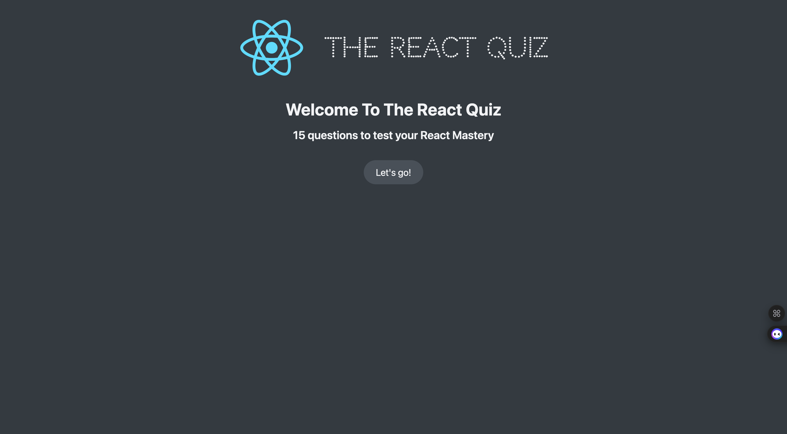
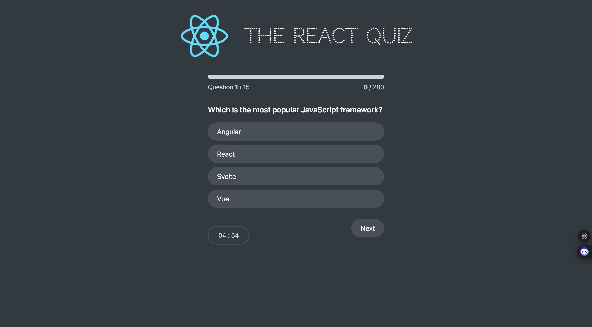
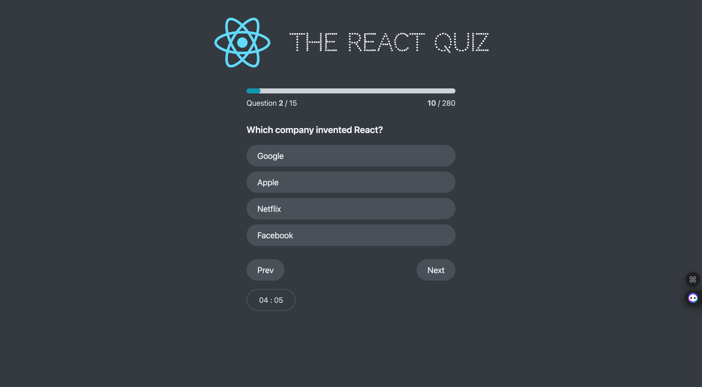
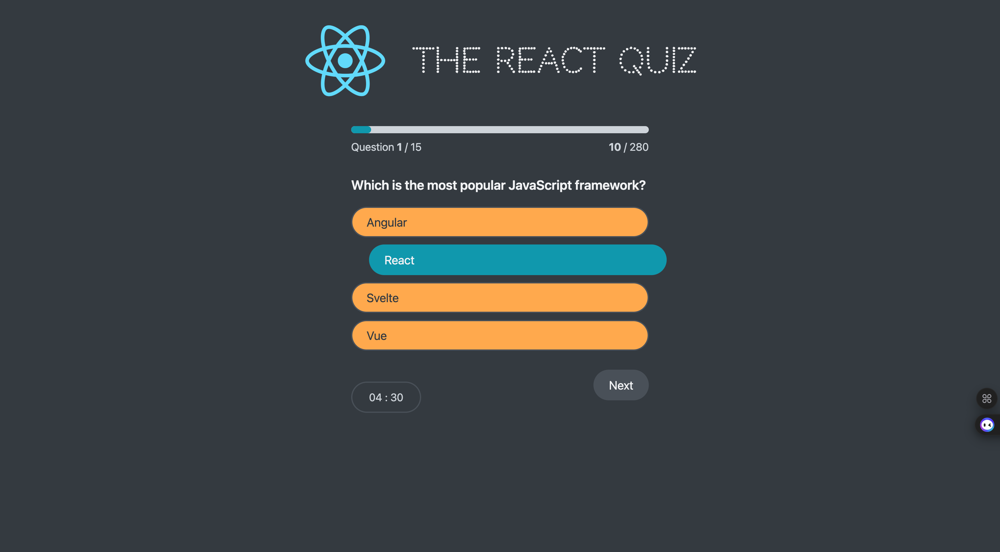
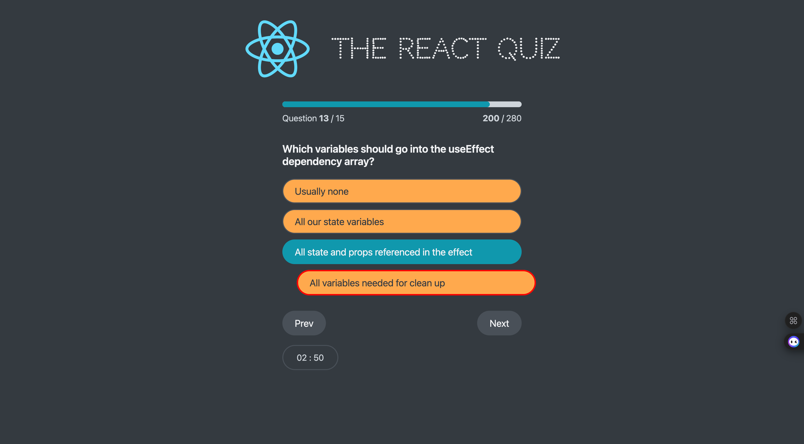
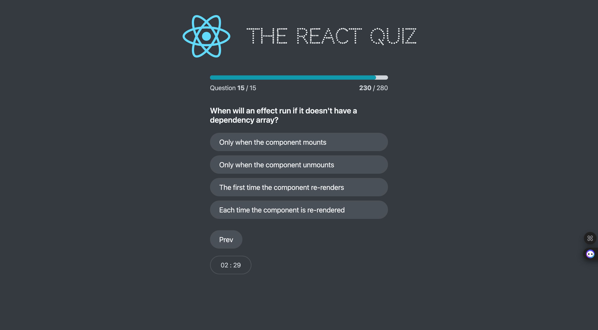
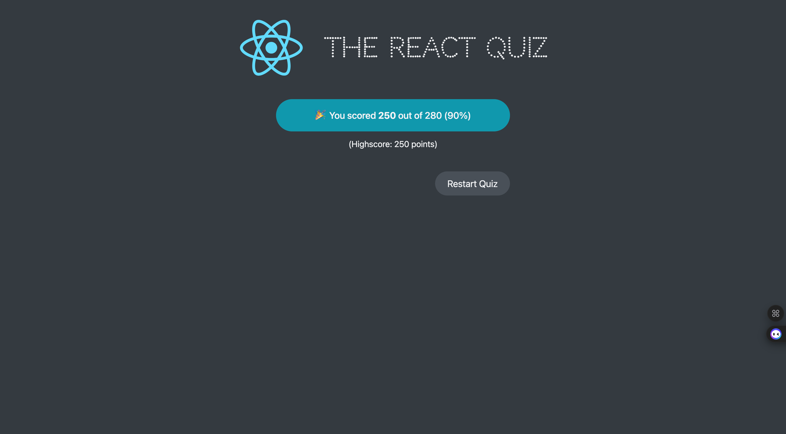

# ReactJs Quiz Application.
"### Project Description: Quiz App with Progress Tracking and Dynamic Navigation

This project is a **dynamic quiz application** built using React that provides an interactive and engaging user experience. It leverages a state management system implemented with `useReducer` to handle various application states, such as loading, active quiz sessions, and completion. The application dynamically fetches quiz questions from an external API and features seamless navigation between questions with conditional rendering of buttons based on user interactions.

### Key Features:
1. **Dynamic Question Navigation**:
   - Users can navigate between questions using "Next" and "Previous" buttons.
   - The "Next" button is disabled until the user selects an answer.
   - A "Finish" button is displayed when the user answers the last question.

2. **State Management**:
   - Utilizes `useReducer` to manage complex states, including questions, current index, user answers, and total points scored.
   - Tracks user progress and displays the total score at the end of the quiz.

3. **Progress Tracking**:
   - Displays the user's current progress (e.g., question index and total points scored) in real-time.
   - Includes a progress bar for visual feedback on quiz completion.

4. **Dynamic API Integration**:
   - Fetches quiz questions dynamically from an external API.
   - Handles errors gracefully, displaying an error message if the API call fails.

5. **Responsive User Interface**:
   - Provides a clean and intuitive UI with responsive design for seamless usage across devices.
   - Includes visual feedback for disabled buttons, ensuring a smooth user experience.

6. **Time Tracking**:
   - Provide real time remaining in minuets and seconds
   - The quiz would be completed automatically as soon as the time elapses .

7. **Restart Functionality**:
   - Users can restart the quiz at any point, resetting all progress and answers.

8. **Completion Screen**:
   - Displays a summary screen with the user's final score and total possible points after completing the quiz.

### Technologies Used:
- **React**: For building the user interface and managing component state.
- **CSS**: For styling the application and providing visual feedback (e.g., disabled buttons).
- **useReducer Hook**: For managing complex application states in a predictable and scalable way.
- **Fetch API**: For fetching quiz data from an external API.

### Use Cases:
- **Educational Platforms**: Ideal for creating engaging quizzes for students.
- **Skill Assessments**: Can be used for online skill tests and certifications.
- **Entertainment**: Suitable for creating fun and interactive trivia games.

This project demonstrates a well-structured approach to building scalable, state-driven React applications with real-time progress tracking and user interaction.
"











## Built With

- JSX,css, JavaScript, React, Reducer hook, React Hooks,
- Visual Studio, Git & GitHub;


## Live Demo (if available)

[Live Demo Link]() 

## Getting Started

To run this project, you only need a computer with a browser (like Google Chrome, Mozilla Firefox, Microsoft Edge, Apple Safari, etc.) installed, and follow these steps:

1. In your terminal, in the folder of your preference, type the following bash command to clone this repository:

```sh
git@github.com:fortuneonyeka/react-quiz.git
```

2. Now that you have already cloned the repo run the following commands to get the project up and running:
```sh
cd react-quiz
npm install
npm start
```

3.  You can start the quiz.

4.  All the changes will be automatically updated on your local server on http://localhost:3000/. You can stop your local server at any time hitting `<Ctrl> + C` on your keyboard.


## Author

👤 **Ihedoro Fortunatus O**

- GitHub: [@fortuneonyeka](https://github.com/fortuneonyeka)
- Twitter: [@onyekafortune](https://twitter.com/onyekafortune)
- LinkedIn: [Ihedoro Fortunatus](https://www.linkedin.com/in/fortunatus-ihedoro/)

## 🤝 Contributing

Contributions, issues, and feature requests are welcome!

## Show your support

Give a ⭐️ if you like this project!